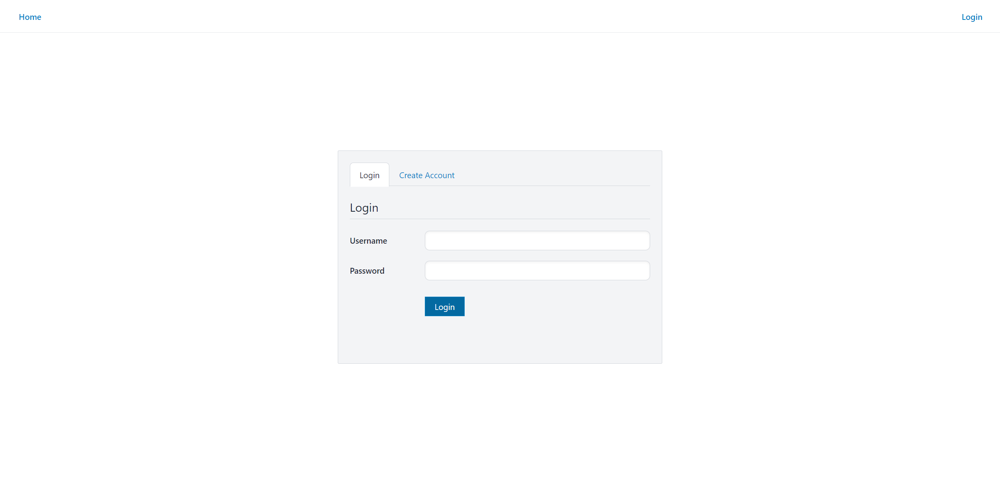
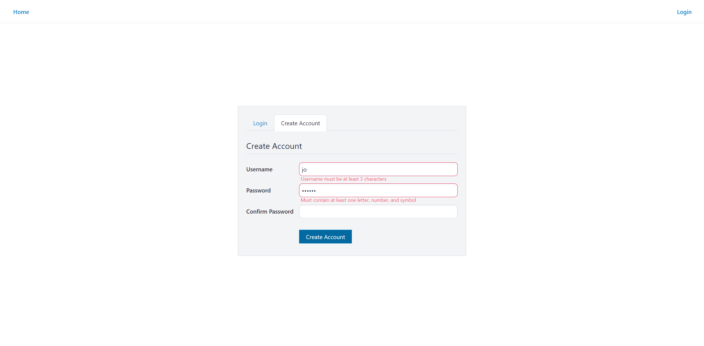
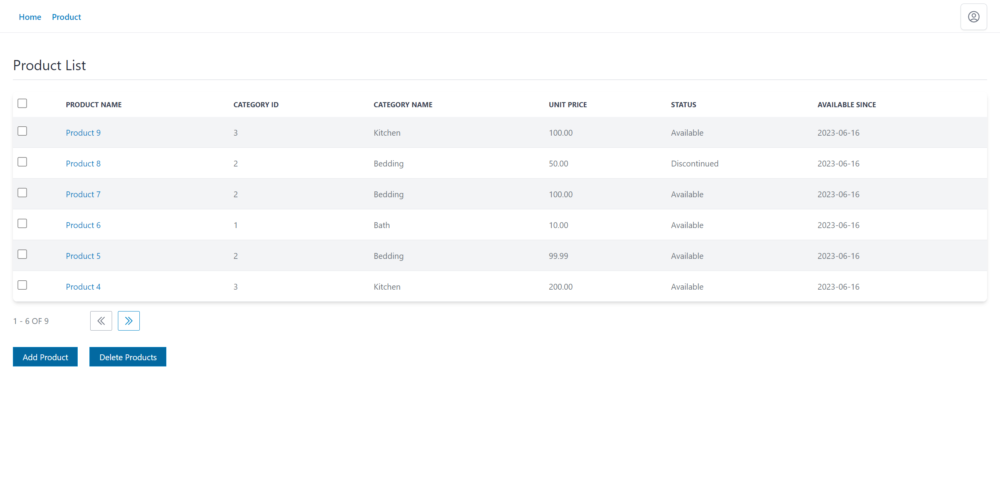
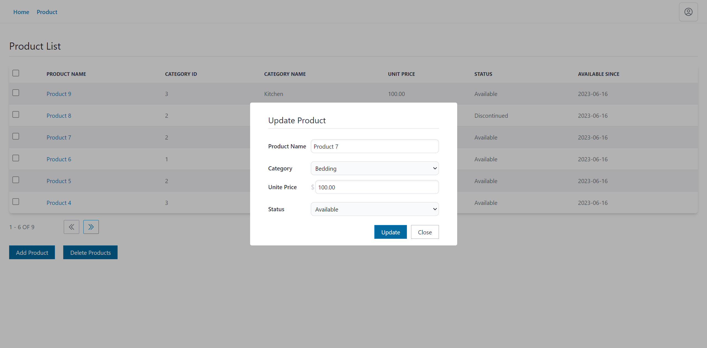
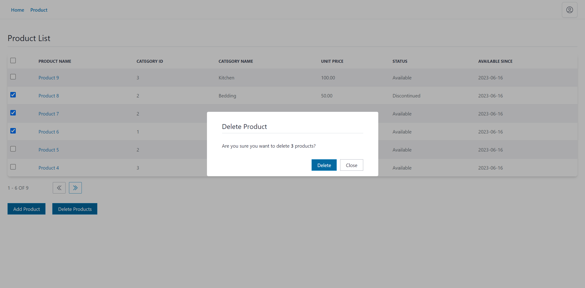

# Auth and Products - API (Express.js + TypeORM + JSON Web Token)

**About:** Backend API of the "Auth and Products" demo. Built using Express.js, TypeORM (PostgreSQL), JSON Web Token.

**_Check frontend UI: [https://github.com/remankader/auth-and-products-ui](https://github.com/remankader/auth-and-products-ui)_**

**Features:**

- Registration
- Login
- Logout
- Add Product
- Update Product
- Delete Product
- Product List Table

## Screenshots

| | | |
|:-:|:-:|:-:|
|  |  |  |
| Login | Registration | Product List Table |

| | | |
|:-:|:-:|:-:|
|  |  |  |
| Add Product | Update Product | Delete Product |

## Start Development Server

- **Step 1:** On root directory make a copy of **.env.example** and rename it to **.env**

- **Step 2:** Update values in **.env**

- **Step 3:** Install dependency packages by running:

```bash
npm install
# or
yarn install
```

- **Step 4:** Start development server by running:

```bash
npm run dev
# or
yarn dev
```

- **Step 5:** By default you can make api calls to [http://localhost:8000](http://localhost:8000)

## Migration

- **Generate:** Generate migration file/files if needed by running:

_( **Note:** A generated migration file already available in **./src/migrations/** directory. Only run this command if new changes have been made to **./src/entities/** directory )_

```bash
npm run migration:generate --name=file_name_here
# or
yarn migration:generate --name=file_name_here
```

- **Run:** Now run migration by running:

_( **Note:** Make sure there is an empty database with the name specified in the **.env** file. PostgreSQL was chosen for this demo )_

```bash
npm run migration:run
# or
yarn migration:run
```

_( **Note:** Postman Collection of this project is available in **./doc/postman** directory )_

**_[ Built on Node v18.15.0 ]_**
